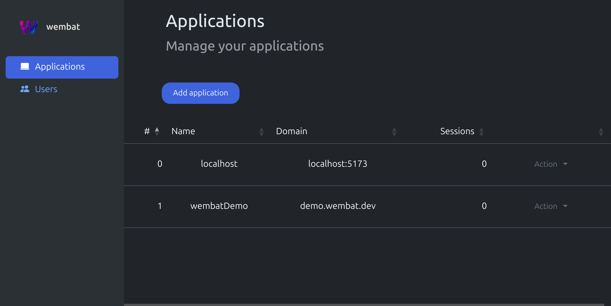

     
     
    

        
    

    <strong>
        Try using Wembat at <a href="https://demo.wembat.dev">demo.wembat.dev</a>
         
        See <a href="https://wembat.dev/introduction.html">Documentation</a>
         
    </strong>

## What is Wembat?

Wembat is a powerful, yet tiny framework that gives your users passkey/WebAuthn sign‑in and lets you encrypt data client‑side using the PRF extension — with an API that stays out of your way. Bring your own UI, wire up a couple of actions, and you’re done.

## Why you should adopt Wembat?

🔒 Passwordless & phishing‑resistant by design (WebAuthn + passkeys)

🧪 TypeScript-first client with clean, minimal APIs

🧩 Drop‑in backend with a dashboard to manage apps & keys

🔐 Built‑in encryption derived from device credentials via PRF

🖥️ Multi‑device onboarding & session linking out of the box

Based on the awesome work of [SimpleWebAuthn](https://github.com/MasterKale/SimpleWebAuthn)

## What does it look like?

Manage your applications with an intuitive dashboard.

## How do I get started?

- Setup Wembat backend with the documentation at https://wembat.dev/setup
- Getting started in your application with the documentation at https://wembat.dev/getting-started

## How can I be part of it?

In order to provide a fully functional und updated open source project I'm very open for requests to join this project.
