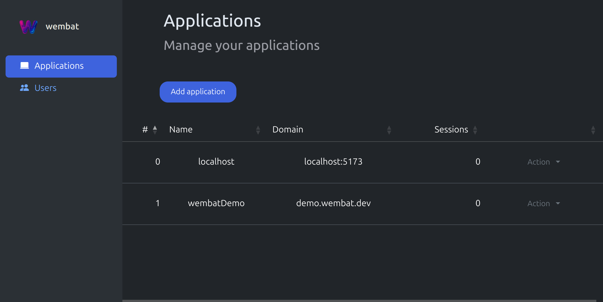

# Introduction

Wembat is an open source framework to enable developers to create an easy to setup authentication workflow with WebAuthn und encrypt their user data locally with the help of the WebAuthn PRF Extension.

::: info
Wembat enables you to create a central authentication hub for all your applications, users can **onboard multiple devices for authentication and encryption.**
:::

You can setup the backend in minutes and start developing application with a powerful set of tools to handle authentication and encryption.

An intuitiv dashboard helps developers to manage their applications.

